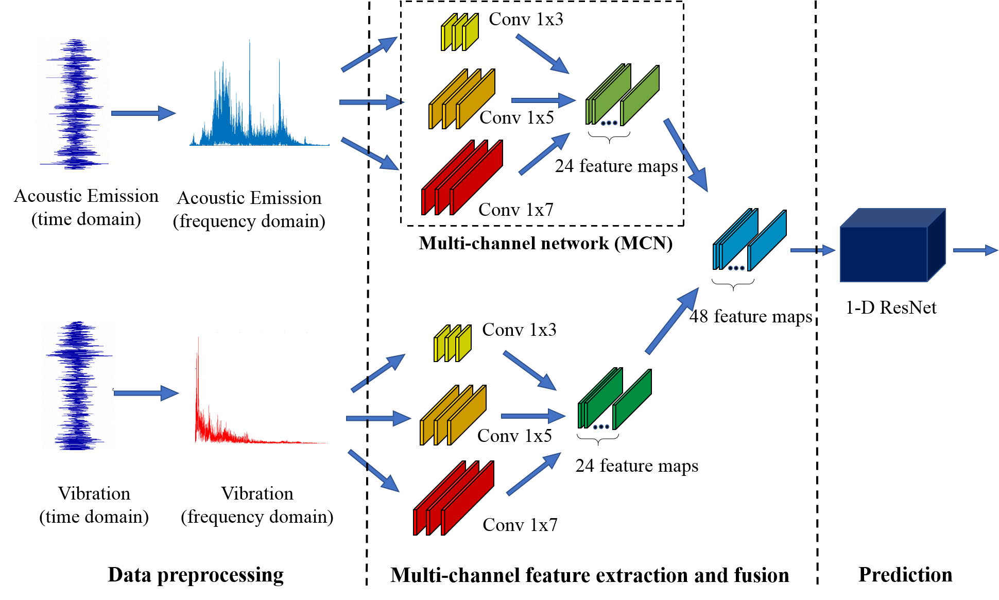
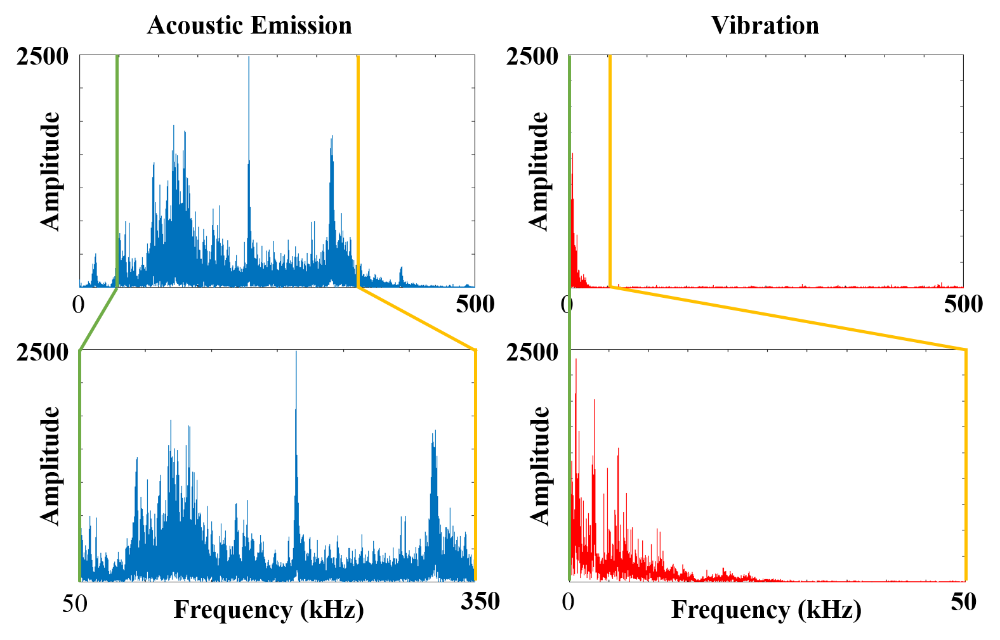
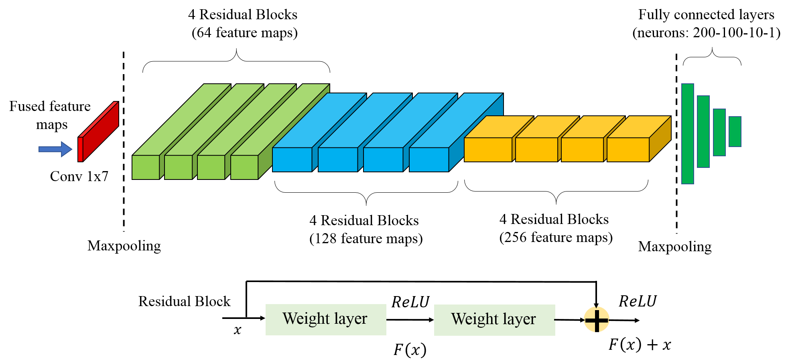
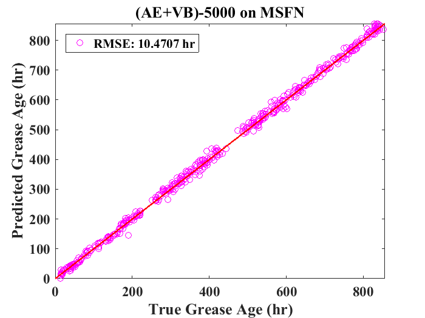

# bearing-grease-age-prediction
This work presents a multi-feature fusion neural network (MSFN) comprised of two inception layer-type multiple channel networks (MCN) for both inner-sensor and cross-sensor feature fusion and a deep residual neural network (ResNet) for accurate grease life prediction and bearings health monitoring.

An inception layer-type network MCN is proposed to learn representative features from vibration (VB) and acoustic emission (AE), respectively. The designed architecture contains three channels with different filter sizes at the same level, which allows the model to identify and select appropriate filters directly contributing to feature extraction and model prediction.

To address the challenge of “curse of dimensionality” and large volume of data collected from VB and AE sensors, the original time-series data is transformed to the frequency domain by a Fast Fourier Transform (FFT) with different sampling intervals. As a result, two datasets with different sequence lengths (5,000 and 50,000, respectively) are constructed for comparative analysis. 

The MSFN consists of two multi-channel networks (MCN) and a 1-D ResNet that can effectively extract and concatenate features from VB and AE sensor by a two-stage fusion process to enhance prediction performance.

To evaluate MSFN performance, each component of MSFN including MCN and ResNet, as well as the overall MSFN model are evaluated separately on the two datasets above. It is convincingly found that the MSFN outperforms the single sensor model significantly in prediction accuracy.Analysis of the experimental results shows that the proposed multi-feature fusion network is able to extract comprehensive features from data of longer sequences, accurately predict the grease age with Root Mean Square Error (RMSE) less than 10 hours, and outperforms other models based on data from a single sensor source. 

